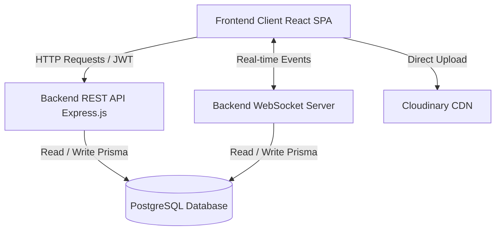

<div align="center">

# 🐾 PawMitra

**A comprehensive, real-time community ecosystem dedicated to reuniting lost pets with their owners and facilitating pet adoptions seamlessly.**

[](https://www.typescriptlang.org/)
[](https://react.dev/)
[](https://nodejs.org/)
[](https://www.postgresql.org/)
[](https://tailwindcss.com/)
[](https://expressjs.com/)

</div>

<br/>

## 📖 About the Project

**PawMitra** is a powerful full-stack application designed to build a compassionate community around pet welfare. It bridges the gap between those who have lost a pet, those who have found one, and those looking to welcome a new furry friend into their home. 

By combining intuitive UI design with a robust backend architecture, **PawMitra** offers a fast, reliable, and real-time experience. From the moment a user signs up to the moment they successfully adopt or reunite with a pet, every step is optimized for security and ease of use.

---

## ✨ Key Platform Features

- **🐾 Pet Lifecycle Management:** Users can post reports for Lost, Found, and Adoptable pets. Admins review and approve these reports, ensuring community safety and quality.
- **📩 Real-time Communication:** Powered by native WebSockets, users can engage in direct messaging (DMs) or seamless group chat rooms automatically provisioned upon adoption approvals.
- **🔐 Robust Security:** End-to-end JWT authentication, strict field validation using `Zod`, encrypted passwords, and secure OTP email verification for all signups.
- **🖼️ Direct Asset Uploads:** Integration with Cloudinary allows users to upload high-quality images of pets directly from the frontend, secured by cryptographically signed backend tokens.
- **🛡️ Admin Dashboard:** A dedicated space for platform administrators to monitor analytics, manage user accounts, validate pet reports, and enforce community guidelines.

---

## 🏗️ System Architecture

The project is split into two independent but tightly coupled repositories within this workspace:

1. **Frontend (`/frontend`)**: A React SPA that consumes the API and manages the WebSocket connections to update the UI optimistically.
2. **Backend (`/backend`)**: An Express.js REST API wrapped around Prisma ORM acting as the single source of truth for PostgreSQL database interactions.

Here is a high-level overview of the ecosystem:



---

## 📁 Project Documentation

Detailed documentation, setup guides, API references, and architecture details are available in the respective sub-repositories. Click the links below to dive into the specifics of either application layer:

### 🖥️ [Frontend Client Docs](./frontend/README.md)
The user-facing application built for speed and responsiveness.
**Tech:** React 18, Vite, TypeScript, Tailwind CSS, Zustand, React Router, shadcn/ui.

### ⚙️ [Backend Core API Docs](./backend/README.md)
The central orchestrator handling business logic, the database, and real-time syncing.
**Tech:** Node.js, Express 5, TypeScript, PostgreSQL, Prisma ORM, ws, Zod.

---

## 🚀 Quick Start / Local Setup

To run the entire PawMitra ecosystem on your local machine, you will need to operate both the Frontend and Backend servers simultaneously. 

### Prerequisites
- **Node.js** (v18.0.0 or higher)
- **PostgreSQL** (Local instance or cloud provider like Supabase/Neon)
- **Cloudinary Account** (for image storage API keys)

### Step 1: Set up the Backend
1. Open a terminal and navigate to the backend directory:
   ```bash
   cd pawmitra/backend
   ```
2. Install dependencies:
   ```bash
   npm install
   ```
3. Create a `.env` file in the `backend` root by copying the `.env.example`. You must provide your PostgreSQL `DATABASE_URL`, a secure `JWT_SECRET`, and your `CLOUDINARY_*` keys.
4. Run migrations and generate the Prisma Client:
   ```bash
   npx prisma migrate dev
   npx prisma generate
   ```
5. Start the backend development server:
   ```bash
   npm run dev
   ```

### Step 2: Set up the Frontend
1. Open a **new** terminal alongside your running backend and navigate to the frontend directory:
   ```bash
   cd pawmitra/frontend
   ```
2. Install dependencies:
   ```bash
   npm install
   ```
3. *(Optional)* The `.env` variables default to `http://localhost:3000` for the backend. If you changed the backend port, create a `.env` here:
   ```env
   VITE_API_URL=http://localhost:3000
   VITE_WS_URL=ws://localhost:3000
   ```
4. Start the frontend development server:
   ```bash
   npm run dev
   ```

**🎉 Success!** You can now open your browser and head to `http://localhost:5173` to experience the platform!

---

<div align="center">
  <p>Built with ❤️ by Rn :)</p>
</div>
